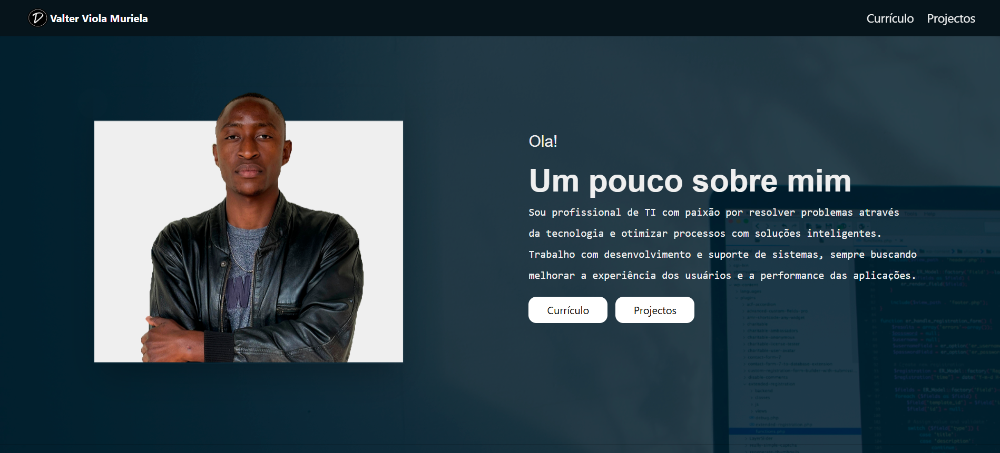

🌐 Site Pessoal

Meu site pessoal desenvolvido com **React e Tailwind CSS** — uma forma moderna, rápida e responsiva de apresentar quem sou, meus projectos e formas de contacto.

  

## 🚀 Tecnologias Utilizadas

- ⚛️ **React** — Biblioteca JavaScript para criação de interfaces dinâmicas  
- 🌀 **Tailwind CSS** — Framework CSS utilitário para estilização rápida e responsiva  
- 🧠 **TypeScript** — Superset do JavaScript com tipagem estática  
- 🌐 **Netlify** — Plataforma utilizada para hospedagem e deploy contínuo

## 🧱 Estrutura do Projeto
Site_Pessoal/
├── index.html
├── style.css
├── script.js
├── imagens/
└── README.md

## 🌍 Acesse o Site

👉 [Clique aqui para visitar](https://valterviola.netlify.app/)

## 💡 Funcionalidades

- Página inicial com apresentação pessoal  
- Secção “Sobre mim” com foto e bio
- Curriculum Vitae 
- Lista de projectos desenvolvidos  
- Links diretos para GitHub e LinkedIn  
- Design responsivo para mobile

## 👨‍💻 Autor

**Valter Viola Muriela**  
📧 djivalter@gmail.com  
🔗 [GitHub](https://github.com/djiValter)

## 📄 Licença

Este projeto é de **minha autoria** e todos os direitos são reservados.  
Sinta-se à vontade para consultar, mas **não é permitido uso ou redistribuição sem minha autorização**.

